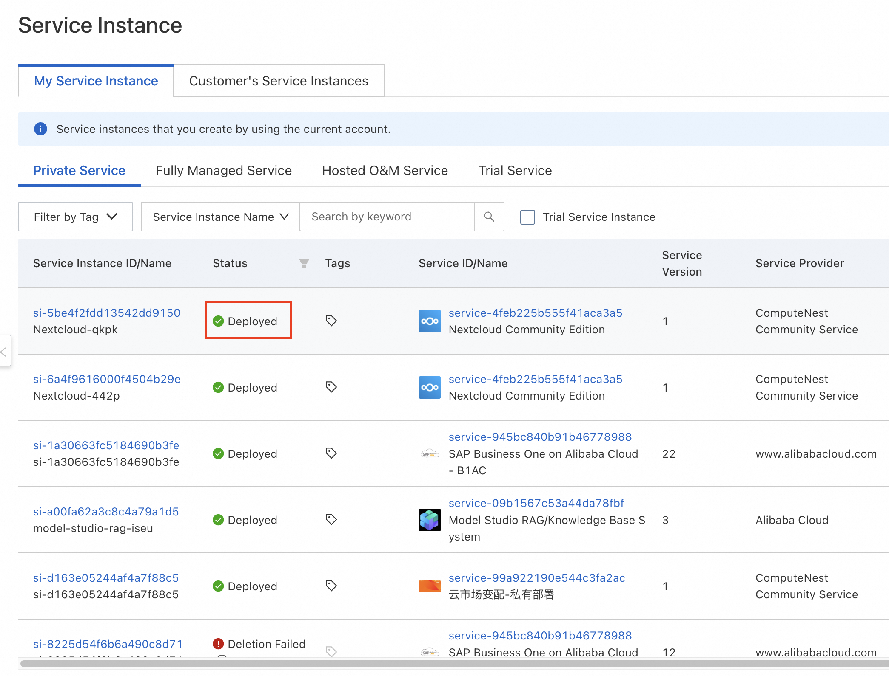

# Quick Deployment of Nextcloud on Compute Nest

>**Disclaimer: **This service is provided by a third party. We make every effort to ensure its security, accuracy, and reliability, but we cannot guarantee it will be completely free from failures, interruptions, errors, or attacks. Therefore, our company hereby declares: we make no representations, warranties, or commitments regarding the content, accuracy, completeness, reliability, suitability, or timeliness of this service, and we will not be liable for any direct or indirect losses or damages resulting from your use of this service; we assume no responsibility for the content, accuracy, completeness, reliability, suitability, or timeliness of third-party websites, applications, products, and services accessed through this service, and you bear the risks and responsibilities arising from such use; we will not be liable for any losses or damages, including but not limited to direct loss, indirect loss, loss of profits, loss of goodwill, loss of data, or other economic losses, even if our company has been previously informed of the possibility of such losses or damages; we reserve the right to modify this statement from time to time, so please check this statement regularly before using this service. If you have any questions or concerns about this statement or the service, please contact us.

## Overview

Nextcloud Hub is a fully open-source cloud-based content collaboration platform from Germany. Team members can access, share, and edit documents, chat, participate in video calls, and manage emails, calendars, and projects via mobile, desktop, and web interfaces. Currently, Nextcloud's product positioning is a complete collaboration platform that ensures data security, similar to domestic enterprise platforms like DingTalk or Feishu, with the advantage that since its inception in 2016, Nextcloud has been dedicated to building a cloud-based collaboration platform that prioritizes data security compliance, offering more mature cloud-hosted application solutions for data security, significantly reducing deployment and maintenance costs for business users. Nextcloud official website: https://nextcloud.com/

By 2021, Nextcloud had over 400,000 online servers, and by the end of 2023, the Nextcloud team reached 100 members spread across more than 20 countries/regions, working remotely or from offices in Berlin and Stuttgart.

Alibaba Cloud Compute Nest has packaged an all-in-one Nextcloud into a one-click deployment service. You do not need to download code or install complex dependencies, nor do you need to connect to a foreign VPN. Simply fill in a few parameters and wait two minutes to access your Nextcloud application.

## Prerequisites

Deploying a Nextcloud Community Edition service instance requires access and creation operations on certain Alibaba Cloud resources. Therefore, your account needs permissions for the following resources.

**Note**: These permissions are required only when your account is a RAM account.

| Permission Policy Name          | Notes                                                             |
|---------------------------------|-------------------------------------------------------------------|
| AliyunECSFullAccess             | Permission to manage ECS (Elastic Compute Service)                |
| AliyunVPCFullAccess             | Permission to manage VPC (Virtual Private Cloud)                  |
| AliyunROSFullAccess             | Permission to manage ROS (Resource Orchestration Service)         |
| AliyunComputeNestUserFullAccess | Permission to manage user-side operations for ComputeNest Service |

## Billing Explanation

The main costs associated with deploying the Nextcloud Community Edition on Compute Nest involve:

- The selected vCPU and memory specifications
- The type and capacity of the system disk
- The public network bandwidth

## Deployment Architecture

    

## Parameter Description
| Parameter Group     | Parameter Item        | Description                                                                                                                                          |
|---------------------|-----------------------|------------------------------------------------------------------------------------------------------------------------------------------------------|
| Service Instance    | Service Instance Name | No more than 64 characters, must start with an English letter, and can contain numbers, English letters, hyphens (-), and underscores (_).           |
|                     | Region                | The region where the service instance is deployed.                                                                                                   |
|                     | Pricing Type          | Billing type for resources: Pay-as-you-go and Annual/Monthly Subscription.                                                                           |
| ECS Instance Config | Instance Type         | The instance specifications available in the zone.                                                                                                   |
|                     | Instance Password     | Length of 8-30, must include three of the following (uppercase letters, lowercase letters, numbers, special symbols from ()`~!@#$%^&*-+={}:;'<>,.?/) |
| Network Config      | Zone                  | The availability zone where the ECS instance resides.                                                                                                |
|                     | VPC ID                | The VPC where the resource is located.                                                                                                               |
|                     | Switch ID             | The switch where the resource is located.                                                                                                            |

## Deployment Process
1. Visit the ComputeNest Nextcloud Community Edition [Deployment Link](https://computenest.console.aliyun.com/service/instance/create/ap-southeast-1?type=user&ServiceName=%20Nextcloud社区版) and fill in the deployment parameters as prompted. Among these, select Singapore as the region (domestic regions cannot be accessed), choose Pay-as-you-go for the pricing type, select any zone ID and create a new VPC network for the zone configuration, and keep the default values for the rest of the sections.
   
   

2. After completing the parameter entry, confirm the parameters and click **Next: Confirm Order**.
   

3. Upon successful order confirmation and agreement to the service terms, you will be able to view the quotation details. Click **Create Now** to proceed to the deployment phase.
   

4. After successful submission, click **View Service**. Wait for the deployment to complete, which should take approximately 2 minutes.
   
   

5. Once deployment is finished, you can begin using the service. Enter the service instance details, copy the entire URL of the row within the red box into your browser, then retain only the portion within the red box and change http to https to access the Nextcloud application.
   

6. Upon successful access, you will arrive at the following page. Copy the text within the red box and click the Open Nextcloud AIO login button.
   

7. Paste the text copied in the previous step into the red box and click Login. This will allow you to start configuring and using Nextcloud. Should you encounter any issues during configuration and use, please refer to the [Nextcloud Official User Documentation](https://github.com/nextcloud/all-in-one/blob/main/readme.md).
   