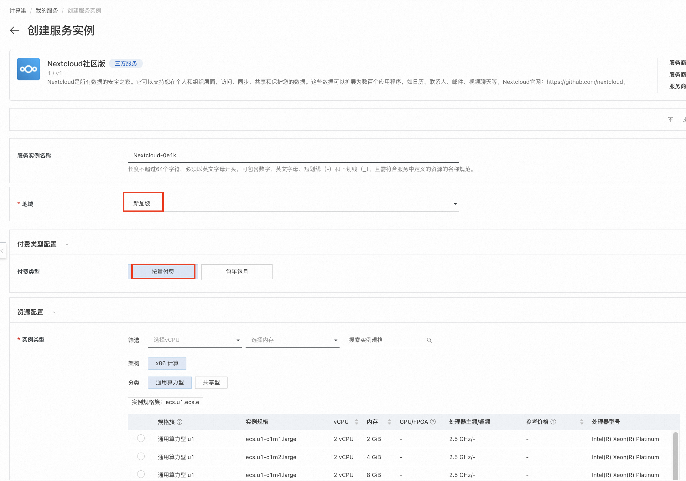
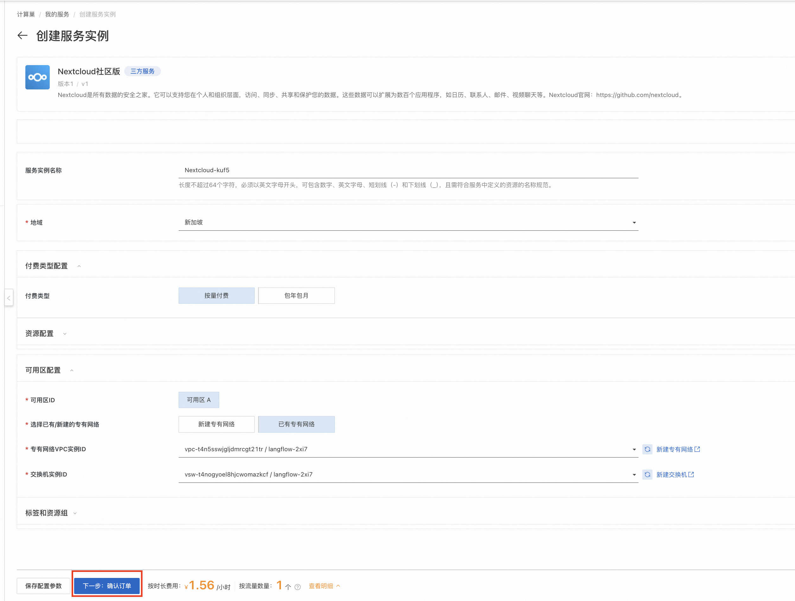

# 使用SaaS化的Aurora应用快速搭建私人ChatGPT助手

>**简介：** Aurora是一个带UI且免费的GPT私人聊天助手，可切换GPT-3.5，4，4o等常用版本。用户可通过部署Aurora，快速打造自己专属的AI助手。阿里云计算巢已将Aurora打包为SaaS应用，您无需下载代码或安装复杂依赖，也无需连接国外VPN，仅需填写5个参数并等待5分钟，即可通过国内网络快速搭建私人聊天助手，非常适合非技术人员。部署前需确保已开通阿里云账号且余额充足。

## 什么是Aurora？
ChatGPT是美国人工智能研究实验室OpenAI在2022年11月30日推出的一款人工智能技术驱动的语言模型应用。由于OpenAI的国际背景，相比国内的多款大模型，ChatGPT在处理英文、跨文化信息时具有优势，能够更好地理解和生成不同语言和文化背景下的内容。

Aurora是一个带UI且免费的GPT私人聊天助手，您可通过Aurora，在简洁的UI配置下访问GPT，快速打造您专属的AI助手。专属AI助手具体不限流，响应速度快，模型种类多且切换方便的显著优势。Aurora官方网址：https://github.com/aurora-develop/aurora 。

## 部署和使用方式

### 服务器部署
>**前提条件：** 1. 一台服务器；2. 国内用户可能需要连接外网VPN。

Aurora支持编译部署、docker-compose和dockerfile等多种方式，较便捷地部署到您自己的服务器中，具体步骤请参考下图或[官方文档](https://github.com/aurora-develop/aurora)。
    

部署后，访问http://你的服务器ip:8080/web，并在设置中配置自己的Api密钥 即可使用。默认配置见https://github.com/aurora-develop/aurora的docker-compose.yml文件。
    

在右上角可以选择使用的GPT版本，支持切换GPT-3.5，4，4o等常用版本，并支持自定义角色性格、回答质量、回复速度和是否允许长回复等关键设定。
    

填写OpenAI Api密钥，并根据自己需求设定好模型后，即可开始与你的GPT私人聊天助手进行对话。如您无法得到回复，可尝试连接VPN。
    

### 阿里云计算巢快速部署
>**前提条件：** 1. 已开通阿里云账号且余额充足。

阿里云计算巢已将Aurora打包为SaaS应用，您无需下载代码或安装复杂依赖，也无需连接国外VPN，仅需填写5个参数并等待5分钟，即可通过国内网络快速搭建私人聊天助手。

部署流程：

1. 访问计算巢Aurora社区版[部署链接](https://computenest.console.aliyun.com/service/instance/create/default?type=user&ServiceName=Aurora%20%E7%A4%BE%E5%8C%BA%E7%89%88)
，按提示填写部署参数。其中，地域选择新加坡（国内地域无法访问GPT模型），付费类型选择按量付费，可用区配置选择任意可用区ID与新建专有网络，其他部分保持默认值即可。
    
    

2. 参数填写完成，确认参数后点击**下一步：确认订单**。
   

3. 确认订单完成后同意服务协议，可以看到询价明细，点击**立即创建**
   进入部署阶段。
    
4. 提交成功后，点击**去列表查看**。等待部署完成，预计5分钟左右。
   
   

5. 等待部署完成后就可以开始使用服务，进入服务实例详情点击ServiceAddress链接。
    

6. 配置自己的OpenAI Api密钥，即可开始与你的GPT私人聊天助手进行对话。
    

7. 开始使用Aurora
    